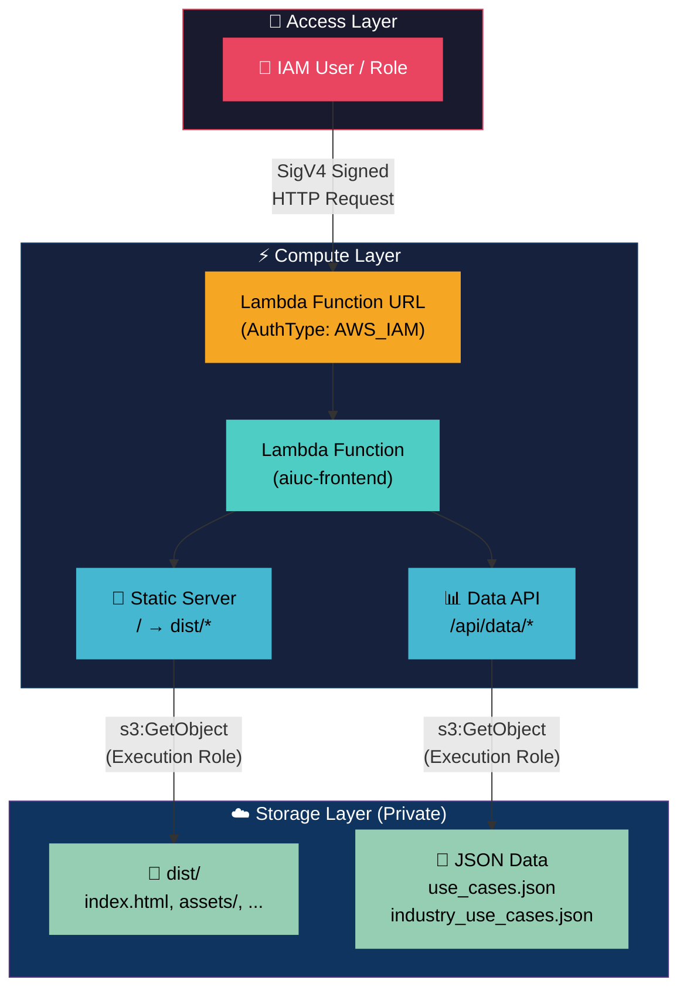

<p align="center">
  
</p>

<h1 align="center">AI Use Case Repository</h1>

<p align="center">
  <strong>Internal AI use case & industry data dashboard — secured with AWS IAM</strong>
</p>

<p align="center">
  
  
  
  
</p>

<p align="center">
  
  
  
  
</p>

<p align="center">
  
  
  
</p>

---

## 📋 Table of Contents

- [Overview](#overview)
- [Architecture](#architecture)
- [Project Structure](#project-structure)
- [Prerequisites](#prerequisites)
- [Local Development](#local-development)
- [Deployment](#deployment)
- [Granting User Access](#granting-user-access)
- [Testing Access](#testing-access)
- [Tech Stack](#tech-stack)

---

## Overview

The **AI Use Case Repository** is an internal dashboard that surfaces AI use case data and industry-specific AI implementation records. The frontend is a React SPA served through an **AWS Lambda Function URL** with **IAM authentication**, ensuring only authorized personnel can access the application and its data.

> **🔒 Confidential — Internal Use Only**

---

## Architecture



> ❌ Direct S3 access → **BLOCKED** (PublicAccessBlock enabled)
> ❌ Unsigned Lambda URL request → **403 Forbidden**
> ✅ Signed request + IAM policy → **Full app access**

### How It Works

| Step  | Description                                                                                  |
| ----- | -------------------------------------------------------------------------------------------- |
| **1** | Authorized user sends a **SigV4-signed** HTTP request to the Lambda Function URL             |
| **2** | AWS validates the signature and checks `lambda:InvokeFunctionUrl` permission                 |
| **3** | Lambda receives the request and determines if it's a static asset or data API call           |
| **4** | Lambda fetches the requested content from the **private S3 bucket** using its execution role |
| **5** | Response is returned to the user — the website loads with all data                           |

> Users **never access S3 directly**. The Lambda acts as a secure proxy.

---

## Project Structure

```
aiuc.spearehead/
├── src/                        # React frontend source
│   ├── App.tsx                 # Main application component
│   ├── components/             # UI components (tables, logo)
│   ├── hooks/
│   │   └── useS3Data.ts        # Data fetching via /api/data/*
│   ├── theme.ts                # MUI theme configuration
│   ├── types.ts                # TypeScript interfaces
│   └── globals.css             # Global styles
├── lambda/
│   ├── index.mjs               # Lambda handler (serves FE + data API)
│   └── package.json            # Lambda dependencies (@aws-sdk/client-s3)
├── package.json                # Frontend dependencies
├── vite.config.ts              # Vite configuration
└── .env                        # Environment variables (S3_REGION, BUCKET_NAME)
```

---

## Prerequisites

Before deploying, ensure you have the following installed:

| Tool            | Version | Purpose                       |
| --------------- | ------- | ----------------------------- |
| **Node.js**     | ≥ 18.x  | Build the frontend            |
| **npm**         | ≥ 9.x   | Package management            |
| **AWS Account** | N/A     | Access to Lambda, S3, and IAM |

```bash
# Verify installations
node --version
aws --version
sam --version
```

Configure AWS CLI with credentials that have admin/deploy permissions:

```bash
aws configure
```

---

## Local Development

```bash
# Install dependencies
npm install --legacy-peer-deps

# Start development server
npm run dev

# Build for production
npm run build

# Preview production build
npm run preview
```

> ⚠️ **Note:** In local dev, the `/api/data/*` routes won't work unless you set up a local proxy or temporarily revert to direct S3 fetch for development.

---

## Deployment

### Automated Deployment (GitHub Actions)

The recommended way to deploy is through GitHub Actions. Pushing to the `main` branch will automatically build the frontend, sync assets to S3, and update the Lambda function.

#### Setup (One-time)

Add the following **Secrets** to your GitHub repository (`Settings` > `Secrets` > `Actions`):

- `AWS_ACCESS_KEY_ID`
- `AWS_SECRET_ACCESS_KEY`
- `AWS_REGION` (e.g., `us-east-2`)
- `S3_BUCKET_NAME` (e.g., `auic`)
- `LAMBDA_FUNCTION_NAME` (e.g., `dev-aiuc-frontend`)

### Deployment GUIDE MANUAL AWS (S3 + Lambda)

This guide explains how to deploy the AIUC frontend using **AWS Lambda** and **S3**, even for non-developers. Follow each step carefully.

---

#### 1️⃣ Build & Package the Project

1. Open a terminal in the project folder.
2. Install dependencies:

```bash
npm install
```

Run only if you found any vulnerabilities in that version

```bash
npm audit fix
```

3. Build the project: `npm run build`
4. Package the Lambda function:

```
cd lambda
npm install --omit=dev
zip -r ../lambda.zip .
cd ..
```

#### 1a. Create S3 Bucket (if you don't have one)

1. Open the [S3 Console](https://console.aws.amazon.com/s3/) → **Create bucket**.
2. Use these settings:

| Option                  | Value / Selection                                        |
| ----------------------- | -------------------------------------------------------- |
| **Bucket name**         | Globally unique (e.g., `auic` or `aiuc-your-org`)        |
| **AWS Region**          | Same as Lambda (e.g., `us-east-2`, `ap-southeast-2`)     |
| **Object Ownership**    | **ACLs disabled** (recommended) – Bucket owner enforced  |
| **Block Public Access** | **Block all public access** ✓ (all 4 checkboxes enabled) |
| **Bucket Versioning**   | Disable (optional: enable for rollback)                  |
| **Default encryption**  | SSE-S3 (recommended) or leave default                    |
| **Advanced settings**   | Leave defaults                                           |

3. Click **Create bucket**.

4. **(Optional)** Add CORS configuration — if you need cross-origin access (e.g., frontend on a different domain):
   - Open your bucket → **Permissions** tab → **Cross-origin resource sharing (CORS)** → **Edit**
   - Paste:

```json
[
  {
    "AllowedHeaders": ["*"],
    "AllowedMethods": ["GET", "HEAD"],
    "AllowedOrigins": ["*"],
    "ExposeHeaders": [],
    "MaxAgeSeconds": 3000
  }
]
```

- Click **Save changes**.

> ⚠️ **Important:** Keep "Block all public access" enabled. The Lambda execution role will access the bucket via IAM — no public access is needed.
> ℹ️ CORS is only needed if the browser will call S3 directly (e.g., presigned URLs). For this setup (Lambda serves everything), CORS is **not required**.

---

#### 2️⃣ Upload Static Files to S3

1. Open the S3 Console.
2. Select your bucket (auic) or the one you created above.
3. **Upload the built frontend** — upload the contents of your local `dist/` folder into a folder named `dist` in your bucket.
4. **Upload data files** — upload these JSON files to the **bucket root** (same level as the `dist` folder):

   | File                      | Location in bucket                         | Purpose                                  |
   | ------------------------- | ------------------------------------------ | ---------------------------------------- |
   | `use_cases.json`          | `s3://your-bucket/use_cases.json`          | AI use case data for the main table      |
   | `industry_use_cases.json` | `s3://your-bucket/industry_use_cases.json` | Industry-specific AI implementation data |

   Both files must be JSON arrays. The dashboard will load but show empty tables if these files are missing.

   **Example structure** — each file is an array of objects:
   - `use_cases.json`: `[{ "capability": 1, "business_function": "...", "ai_use_case": "...", ... }, ...]`
   - `industry_use_cases.json`: `[{ "id": "1", "industry": "...", "ai_use_case": "...", ... }, ...]`

   Place `[]` (empty array) in each file if you have no data yet; the app will run with empty tables.

**Expected bucket structure after upload:**

```
your-bucket/
├── dist/
│   ├── index.html
│   ├── assets/
│   │   ├── index-xxx.js
│   │   └── index-xxx.css
│   └── ...
├── use_cases.json          ← at bucket root
└── industry_use_cases.json ← at bucket root
```

#### 2a. Create Lambda Function (if you don't have one)

1. Open the [Lambda Console](https://console.aws.amazon.com/lambda/) → **Create function**.
2. Choose **Author from scratch**.
3. Use these settings:

| Option             | Value / Selection                                   |
| ------------------ | --------------------------------------------------- |
| **Function name**  | e.g., `dev-aiuc-frontend` (or `aiuc-frontend`)      |
| **Runtime**        | **Node.js 20.x**                                    |
| **Architecture**   | **x86_64** (or arm64 for lower cost)                |
| **Execution role** | **Create a new role with basic Lambda permissions** |
| **Timeout**        | `60` seconds (in Advanced settings)                 |

4. Click **Create function**.
5. After creation, you'll add the **Function URL** and **S3 permissions** in step 4 below.

> 💡 The default basic Lambda role only allows writing logs. We'll add S3 read access in step 4.

---

#### 3️⃣ Upload Lambda Code & Set Environment Variables

1. Open the Lambda Console.
2. Select your function (e.g., `dev-aiuc-frontend`) or the one you created above.
3. In the **Code** tab → **Upload from** → **.zip file** → upload `lambda.zip`.
4. Go to Configuration → Environment variables, and set:

| Key         | Value              |
| ----------- | ------------------ |
| BUCKET_NAME | <YOUR_BUCKET_NAME> |
| S3_REGION   | <YOUR_REGION>      |
| DIST_PREFIX | dist               |

#### 4️⃣ Configure Access

##### Step 4a: Lambda IAM Policy (S3 Access) — Required

The Lambda execution role must have permission to read from your S3 bucket. Without this, you will get **500 Internal Server Error**.

1. In the Lambda Console, go to **Configuration** → **Permissions** → click the **Role name** (opens IAM in a new tab).
2. In the IAM role page, click **Add permissions** → **Create inline policy**.
3. Select the **JSON** tab and paste:

```json
{
  "Version": "2012-10-17",
  "Statement": [
    {
      "Effect": "Allow",
      "Action": ["s3:GetObject", "s3:ListBucket"],
      "Resource": [
        "arn:aws:s3:::<YOUR-BUCKET-NAME>",
        "arn:aws:s3:::<YOUR-BUCKET-NAME>/*"
      ]
    }
  ]
}
```

4. Replace `<YOUR-BUCKET-NAME>` with your actual bucket name (same as `BUCKET_NAME` env var).
5. Click **Next** → enter a policy name (e.g. `S3ReadPolicy`) → **Create policy**.

##### Step 4b: Function URL — Choose one

###### Option A: IAM Authentication

1. **Configuration → Function URL** → **Create function URL** (or **Edit** if one exists).
2. Set **Auth type**: `AWS_IAM`.
3. Click **Save**.

###### Option B: Public Access

1. **Configuration → Function URL** → **Create function URL** (or **Edit** if one exists).
2. Set **Auth type**: `NONE`.
3. Click Additional settings and enable CORS for the lambda use `*`
   You can skip the 3rd point if you already have this Resource-based policy permission
4. **Add Resource-based policy** — go to **Configuration → Permissions → Resource-based policy statements → Add permissions**:
   - **Policy statement**: Function URL
   - **Auth type**: `NONE`
   - **Principal**: `*`
   - **Action**: `lambda:InvokeFunctionUrl`
5. Click **Save**.

---

#### 5️⃣ Deployment Complete

Click on the `Function URL` to access the deployed function.

```
🔗 Lambda Function URL : https://xxxxx.lambda-url.your_lambda_region.on.aws/
🔑 Access Policy ARN   : arn:aws:iam::xxxx:policy/aiuc-frontend-access
```

---

## Granting User Access

### Attach the managed policy to an IAM user

```bash
aws iam attach-user-policy \
  --user-name <USERNAME> \
  --policy-arn <ACCESS_POLICY_ARN>
```

### Attach to an IAM role

```bash
aws iam attach-role-policy \
  --role-name <ROLE_NAME> \
  --policy-arn <ACCESS_POLICY_ARN>
```

### What the policy grants

```json
{
  "Effect": "Allow",
  "Action": "lambda:InvokeFunctionUrl",
  "Resource": "arn:aws:lambda:<region>:<account>:function:aiuc-frontend"
}
```

> That's it — **one permission**. The Lambda's execution role handles all S3 access internally.

---

## Testing Access

### ✅ With authorized credentials

```bash
curl --aws-sigv4 "aws:amz:ap-southeast-2:lambda" \
  --user "$AWS_ACCESS_KEY_ID:$AWS_SECRET_ACCESS_KEY" \
  "https://<function-url-id>.lambda-url.ap-southeast-2.on.aws/"
```

### ❌ Without credentials (should return 403)

```bash
curl "https://<function-url-id>.lambda-url.ap-southeast-2.on.aws/"
# → {"Message":"Forbidden"}
```

### ❌ Direct S3 access (should fail)

```bash
aws s3 ls s3://aiuc/ --no-sign-request
# → An error occurred (AccessDenied)
```

---

## Tech Stack

<p align="center">

| Layer          | Technology              | Badge                                                                                                        |
| -------------- | ----------------------- | ------------------------------------------------------------------------------------------------------------ |
| **Frontend**   | React 19 + TypeScript   |              |
| **UI Library** | Material UI 5           |                    |
| **Build Tool** | Vite 7                  |                 |
| **Tables**     | TanStack Table v8       |   |
| **Runtime**    | AWS Lambda (Node.js 20) |        |
| **Storage**    | Amazon S3 (Private)     |                 |
| **Auth**       | AWS IAM                 |              |
| **IaC**        | Manual / AWS Console    |  |

</p>

---

<p align="center">
  <sub>Powered by <strong>Spearhead</strong> • Confidential – Internal Use Only</sub>
</p>
